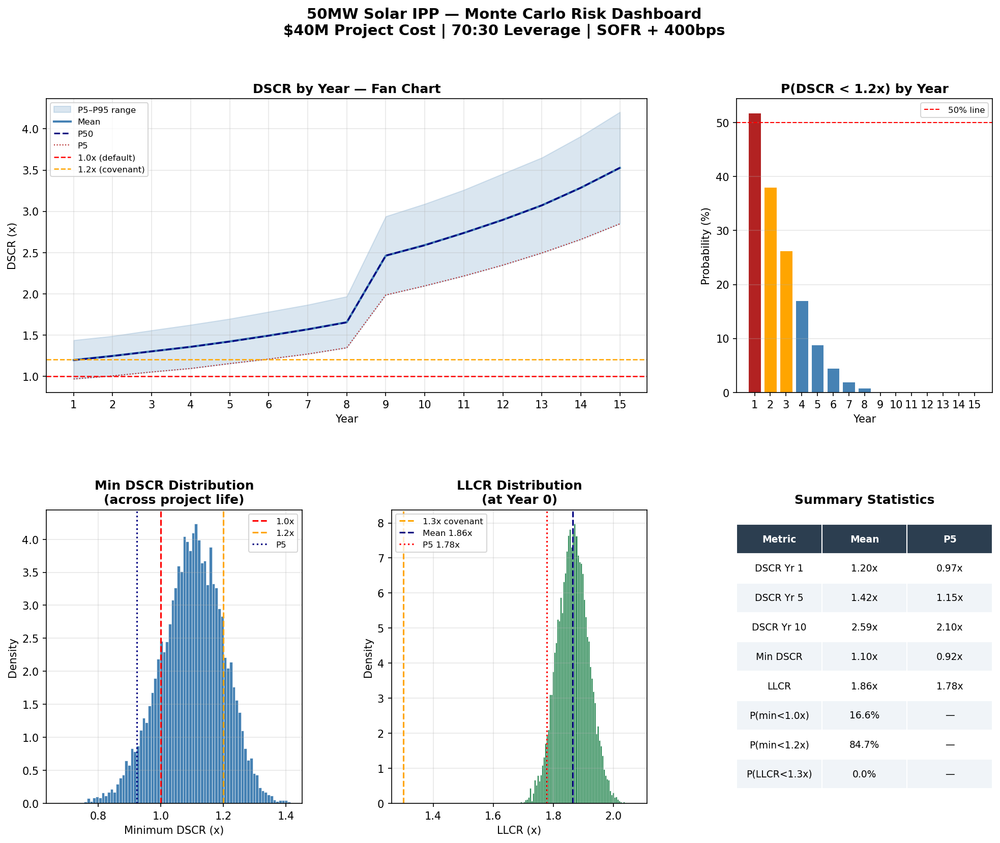

# Solar IPP Monte Carlo Risk Model

Monte Carlo simulation (10,000 runs) stress-testing debt serviceability 
for a 50MW solar IPP in Bangladesh.

## What it models
- Generation uncertainty (normal distribution, 5% std dev)
- Floating interest rate risk (SOFR + credit spread)
- 70:30 debt/equity with IDCOL + commercial debt tranche
- DSCR and LLCR across a 20-year project tenor

## Key outputs
- DSCR fan chart by year (P5/P50/P95)
- Probability of covenant breach by year
- Minimum DSCR distribution across project life
- LLCR distribution at Year 0

## Tools
Python · NumPy · Matplotlib

